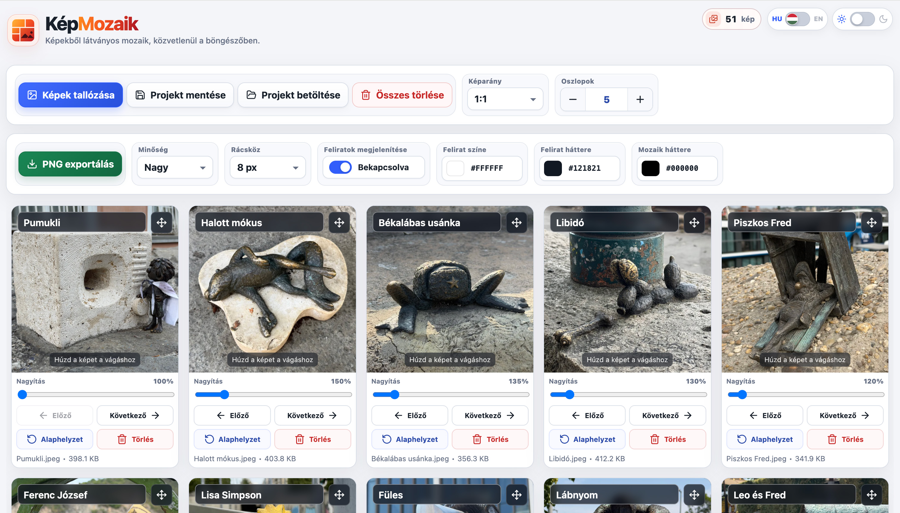

# KépMozaik

Egyszerű, reszponzív, böngészőben futó alkalmazás, amellyel több képből rendezett képmozaik készíthető.

A képek átrendezhetők, kivághatók, nagyíthatók és feliratozhatók, majd az elkészült mozaik egyetlen PNG-képként exportálható.

## Online változat

**[KépMozaik megnyitása](https://lkristof.github.io/kepmozaik/)**



## Főbb funkciók

* Több kép egyidejű betöltése
* Képek hozzáadása fájlválasztóval vagy drag and drop módszerrel
* Képek sorrendjének átrendezése
* Képek pozicionálása és nagyítása a kivágási területen
* Érintőképernyős mozgatás és nagyítás
* Előre definiált és egyéni képarányok
* 1–10 oszlopos elrendezés
* Többsoros képfeliratok
* Feliratszín, feliratháttér és mozaikháttér beállítása
* Állítható rácsköz
* Több exportminőség
* Exportálás PNG-formátumban
* Projekt mentése és visszatöltése JSON-fájlból
* Magyar és angol kezelőfelület
* Világos és sötét megjelenés
* Reszponzív asztali és mobil felület
* Billentyűzettel is használható kezelőelemek

## Adatvédelem

A képek feldolgozása közvetlenül a böngészőben történik.

Az alkalmazás nem tölti fel a kiválasztott képeket külső szerverre. A projekt mentésekor egy helyi JSON-fájl készül, az exportáláskor pedig a böngésző egy PNG-fájlt generál.

## Használat

1. Nyisd meg az [online alkalmazást](https://lkristof.github.io/kepmozaik/).
2. Kattints a **Képek tallózása** gombra, vagy húzd a képeket a feltöltési területre.
3. Állítsd be a képarányt és az oszlopok számát.
4. Mozgasd és nagyítsd a képeket a kívánt kivágás eléréséhez.
5. Rendezd át a képeket a mozgatóelemek segítségével.
6. Adj meg feliratokat, és állítsd be a megjelenésüket.
7. Válaszd ki az exportálási minőséget és a rácsközt.
8. Kattints a **PNG exportálás** gombra.

## Projekt mentése

A **Projekt mentése** gombbal az aktuális munka JSON-fájlba menthető.

A projektfájl tartalmazza:

* a képeket optimalizált formában;
* a képek sorrendjét;
* a kivágási pozíciókat;
* a nagyítási értékeket;
* a képfeliratokat;
* az elrendezési beállításokat;
* az exportálási beállításokat.

A mentett munka később a **Projekt betöltése** gombbal folytatható.

> A projektfájl a beágyazott képek miatt nagy méretű lehet.

## Technológiák

* HTML5
* CSS3
* Vanilla JavaScript
* Canvas API
* File API és Blob API
* Pointer Events
* Local Storage
* GitHub Pages

A projekt nem használ JavaScript frameworköt, csomagkezelőt vagy külső buildrendszert.

## Projektstruktúra

```text
kepmozaik/
├── index.html
├── favicon.ico
├── favicon.svg
├── favicon-96x96.png
├── apple-touch-icon.png
├── web-app-manifest-192x192.png
├── web-app-manifest-512x512.png
├── site.webmanifest
└── og-image.png
```

Az alkalmazás HTML-, CSS- és JavaScript-kódja jelenleg az `index.html` fájlban található.

## Böngészőtámogatás

Modern asztali és mobil böngésző használata ajánlott, például:

* Google Chrome
* Microsoft Edge
* Mozilla Firefox
* Safari

Nagyméretű projektek esetén a memóriahasználat a képek számától, méretétől és az exportálási minőségtől függ.

## Felhasznált ikonok

A kezelőfelület a [Lucide Icons](https://lucide.dev/) ikonjait használja, amelyek az ISC licenc alatt érhetők el.

## Licenc

A projekt az MIT licenc alatt érhető el. További információ a [LICENSE](./LICENSE) fájlban található.
