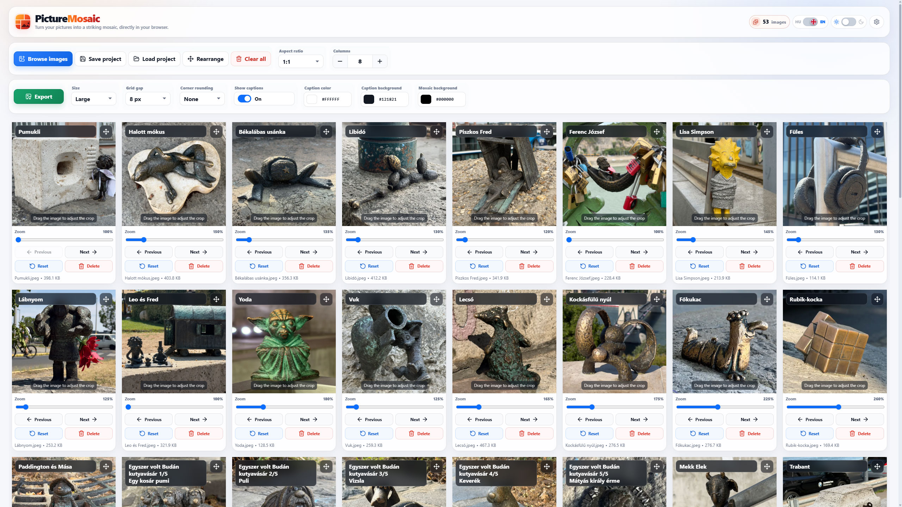

# PictureMosaic

A responsive, fully browser-based application for creating organized and customizable image mosaics from multiple images.

Images can be rearranged, cropped, zoomed, and captioned, and the finished mosaic can be exported as PNG, JPEG, or WebP with configurable output size and compression quality.

## Online Version

**[Open PictureMosaic](https://lkristof.github.io/kepmozaik/)**



## Key Features

* Load multiple images at once
* Add images using the file picker or drag and drop
* Rearrange the order of images
* Position and zoom images within the crop area
* Touchscreen panning and zooming
* Predefined and custom aspect ratios
* Layouts with 1–20 columns, with a configurable maximum
* Multi-line image captions
* Configurable caption color, caption background, and mosaic background
* Adjustable grid spacing
* Multiple export size options
* Live export preview with output dimensions and format details
* Pre-export output-size validation with an in-preview warning for oversized mosaics
* Configurable JPEG and WebP compression quality with quick presets
* Lossless PNG export
* JPEG export for broad compatibility
* WebP export on supported browsers for smaller modern image files
* Save and restore projects using JSON files
* Automatic recovery from optimized browser-local snapshots
* Hungarian and English user interface
* Light and dark themes
* Responsive desktop and mobile interface
* Keyboard-accessible controls

## Privacy

All image processing is performed locally, directly in the browser.

The application does not upload selected images to any external server. Project files and automatic recovery snapshots are created locally in the browser, while exporting generates a PNG, JPEG, or WebP file depending on the selected format and browser support.

## Usage

1. Open the [online application](https://lkristof.github.io/kepmozaik/).
2. Click the **Browse Images** button or drag images into the upload area.
3. Set the aspect ratio and number of columns.
4. Move and zoom the images to achieve the desired crop.
5. Rearrange the images into the desired order.
6. Add captions and customize their appearance.
7. Select the export size, grid spacing, corner rounding, caption visibility, and desired colors.
8. Click **Export** to review the live preview, choose PNG, JPEG, or WebP, and adjust compression quality for JPEG or WebP if needed. Oversized output dimensions are flagged in the preview before rendering.
9. Click the export button in the dialog to download the finished mosaic.

## Saving a Project

Use the **Save Project** button to save your current work as a JSON file so you can continue from the same point later.

The project file includes, among other things:

* the images in an optimized format;
* the image order;
* crop positions;
* zoom values;
* image captions;
* layout settings;
* export settings.

A saved project can be restored using the **Load Project** button.

### Automatic Recovery

The current project state is automatically saved to IndexedDB in the browser. Recovery snapshots store optimized image data together with the image order, crop positions, zoom values, captions, layout settings, and export settings, so the session can be restored quickly after an accidental page refresh.

Automatic recovery is tied to the specific browser and device. It is intended for local session continuity and does not replace the portable JSON file created using the **Save Project** feature.

> The project file may be large because it contains embedded images.

## Technologies

* HTML5
* CSS3
* Vanilla JavaScript
* Canvas API
* File API and Blob API
* Pointer Events
* Local Storage and IndexedDB
* GitHub Pages

The project does not use a JavaScript framework, package manager, or external build system.

## Project Structure

```text
kepmozaik/
├── assets/
│   └── images/
│       ├── apple-touch-icon.png
│       ├── favicon-96x96.png
│       ├── favicon.ico
│       ├── favicon.svg
│       ├── og-image.jpg
│       ├── screenshot-dark.jpg
│       ├── screenshot-light.jpg
│       ├── web-app-manifest-192x192.png
│       └── web-app-manifest-512x512.png
├── index.html
├── LICENSE
├── README.md
└── site.webmanifest
```

The application's HTML, CSS, and JavaScript code is currently contained in the `index.html` file.

## Browser Support

A modern desktop or mobile browser is recommended, such as:

* Google Chrome
* Microsoft Edge
* Mozilla Firefox
* Safari

For large projects, memory usage depends on the number and resolution of the images as well as the selected export size. The application checks the planned output dimensions before rendering and disables export when the mosaic exceeds its internal canvas safety limits.

WebP export is enabled only when the browser can generate WebP files through the Canvas API. On unsupported browsers, the WebP option is disabled and JPEG or PNG can be used instead.

## Icons

The user interface uses icons from [Lucide Icons](https://lucide.dev/), which are available under the ISC License.

## License

This project is available under the MIT License. See the [LICENSE](./LICENSE) file for more information.
